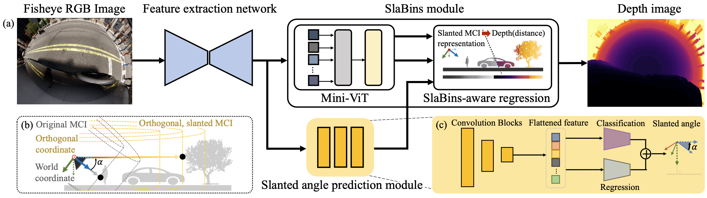

# SlaBins
This is the official repository of ICCV 2023 paper "SlaBins: Fisheye Depth Estimation using Slanted Bins on Road Environments".
[Paper link](https://openaccess.thecvf.com/content/ICCV2023/papers/Lee_SlaBins_Fisheye_Depth_Estimation_using_Slanted_Bins_on_Road_Environments_ICCV_2023_paper.pdf)   [Project page](https://syniez.github.io/SlaBins/)


## Methodology
<p align="center">
  
</p>
Unfortunately, codes are not available because this work is done with company.


## Datasets
We trained and evaluated our method on two fisheye datasets [SynWoodScape](https://arxiv.org/abs/2203.05056), and [KITTI-360](https://github.com/autonomousvision/kitti360Scripts).
Because of the lack of images on SynWoodScape dataset (only 500 sequences are pre-released) and fixed camera slanted angle on KITTI-360 dataset, we used both datasets with our angle augmentation.

Our augmentation codes are available in this repository, and augmented datasets could be downloaded in the [Project page](https://syniez.github.io/SlaBins/).


## Citation
If you found our code helpful for your research, please cite our paper as:

```
 @InProceedings{Lee_2023_ICCV,
    author    = {Lee, Jongsung and Cho, Gyeongsu and Park, Jeongin and Kim, Kyongjun and Lee, Seongoh and Kim, Jung-Hee and Jeong, Seong-Gyun and Joo, Kyungdon},
    title     = {SlaBins: Fisheye Depth Estimation using Slanted Bins on Road Environments},
    booktitle = {Proceedings of the IEEE/CVF International Conference on Computer Vision (ICCV)},
    month     = {October},
    year      = {2023},
    pages     = {8765-8774}
}
```
